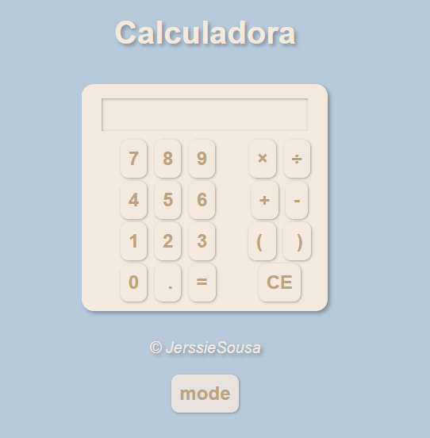
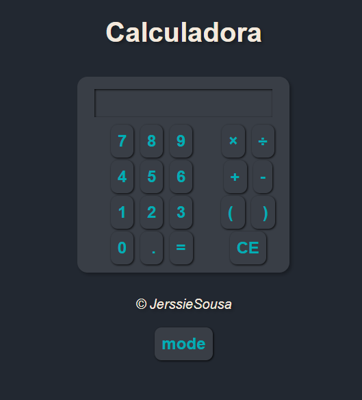

# Calculadora em HTML5/CSS3/JS

* A ideia é contruir uma calculadora comum desde de seu desenho à sua funcionalidade. Assim aprimorar os conhecimentos nas presentes linguagens. 

* Inicialmente foi pensado em construir os botões em formato de tabela em HTML, contudo se viu uma oportunidade de prática no posicionamento em CSS. Assim o posicionamento está todo em CSS.

* O JavaScript foi usado para aumentar o conhecimento sobre a relação com o DOM, para usar o comando toggle foi acrescentado o modo escuro da calculadora com o apoio do CSS.

* O uso do paramentro foi essencial para funcionalidade dos botões e as funções

* Para entrar em contato use o email : <a href="mailto:jerssiers@gmail.com"> Jerssie Sousa</a>
